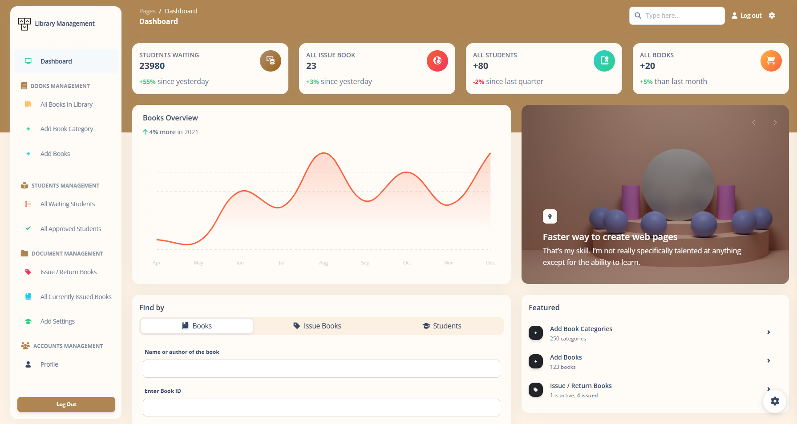

# Library Management System

> An automated system to manage a public library. Admin panel for librarians to control and manage the system easily through an interactive interface.

 + [Development](#development)
 + [Contribute](#contribute)
 + [Setup](#setup)
 + [Features](#features)
 + [Screenshots](meta/README.md)

## Development
The backend of the system is developed on **[Laravel 6.20 PHP MVC Framework](http://laravel.com/)** and requires PHP 7.25 with the appropriate MCrypt extension.
The front end is built on **[Argon Dashboard 2 Laravel Template](https://www.creative-tim.com/product/argon-dashboard-laravel)** ([Demo](https://www.creative-tim.com/live/argon-dashboard-laravel)) which is built on [Bootstrap v5](https://getbootstrap.com/docs/5.3/) using [jQuery](https://blog.jquery.com/2013/07/03/jquery-1-10-2-and-2-0-3-released/) and [CountUp JS](https://inorganik.github.io/countUp.js/)

## Contribute
+ For reporting bug about an incorrect file not being processed, open a new issue.
+ PRs are always welcome to improve exisiting system.

## Demo
| Dashboard |
| --- |
| [] |

## Setup
With the above notes in mind, Windows setup is not too tricky:

* Open git shell;

* `cd C:/path/to/xampp/htdocs`;

* `git clone https://github.com/thanhdat091201/Laravel-OLMS.git`;

* `cd Laravel-OLMS`;

* `composer install --no-dev --no-interaction --prefer-dist`;

* `cp .env.example .env`;

* `php artisan key:generate`;

Create a table for the app in phpmyadmin (or however you prefer);

* `php artisan migrate`;

* `php artisan db:seed`;

* `php artisan serve`

Access the application at http://localhost:8000 (if using the built-in web server) or the appropriate URL for your virtual host setup.


## Features
 + Librarians can be given their authorized login ID and password without which the system can not be accessed.
 + Students can only access limited features, i.e., public access level features which include **searching a book** and **student registration form**.
 + After logging in librarians can search for a specific book, book issue or student from the home panel.
 + Librarians need to make an entry for new books. To automate the process they simply need to enter the number of issues, then the Issue ID for each book issue is generated automatically.
 + Another responsibility of a librarian is to approve students in situations where approval is needed, i.e. where documents are to be verified or some manual work. Librarians have a panel to simply approve / reject students and to view all approved students. The librarian ID is stored alongside each approved/rejected student to keep track.
 + The most important function of any library is to issue and return books. This system includes a panel to view all outstanding logs and a super simple panel to issue and return books for all librarians.

## Documentation
The documentation for the Material Dashboard Laravel is hosted at our [website](https://www.creative-tim.com/product/argon-dashboard-laravel/docs/bootstrap/quick-start/argon-dashboard/index.html).

### Login
If you are not logged in you can only access this page or the Sign Up page. The default url takes you to the login page where you use the default credentials **admin123@gmail.com** with the password **admin**. Logging in is possible only with already existing credentials. For this to work you should have run the migrations. 

The `App/Http/Controllers/Logincontroller.php` handles the logging in of an existing user.

```
    public function login(Request $request)
    {
        $credentials = $request->validate([
            'email' => ['required', 'email'],
            'password' => ['required'],
        ]);

        if (Auth::attempt(['email' => $request->email, 'password' => $request->password])) {
            $request->session()->regenerate();

            return redirect()->intended('dashboard');
        }

        return back()->withErrors([
            'email' => 'The provided credentials do not match our records.',
        ]);
    }
```

### Register
You can register as a user by filling in the name, email and password for your account. You can do this by accessing the sign up page from the "**Sign Up**" button in the top navbar or by clicking the "**Sign Up**" button from the bottom of the log in form.. Another simple way is adding **/register** in the url.

The `App/Http/Controllers/RegisterController.php` handles the registration of a new user.

```
    public function store()
    {
        $attributes = request()->validate([
            'username' => 'required|max:255|min:2',
            'email' => 'required|email|max:255|unique:users,email',
            'password' => 'required|min:5|max:255',
            'terms' => 'required'
        ]);
        $user = User::create($attributes);
        auth()->login($user);

        return redirect('/dashboard');
    }
```

### Forgot Password
If a user forgets the account's password it is possible to reset the password. For this the user should click on the "**here**" under the login form.

The `App/Http/Controllers/ResetPasswordController.php ` takes care of sending an email to the user where he can reset the password afterwards.

```
    public function send(Request $request)
    {
        $email = $request->validate([
            'email' => ['required']
        ]);
        $user = User::where('email', $email)->first();

        if ($user) {
            $this->notify(new ForgotPassword($user->id));
            return back()->with('succes', 'An email was send to your email address');
        }
    }
```

### Reset Password
The user who forgot the password gets an email on the account's email address. The user can access the reset password page by clicking the button found in the email. The link for resetting the password is available for 12 hours. The user must add the email, the password and confirm the password for his password to be updated.

The `App/Http/Controllers/ChangePasswordController.php` helps the user reset the password.

```
    public function update(Request $request)
    {
        $attributes = $request->validate([
            'email' => ['required'],
            'password' => ['required', 'min:5'],
            'confirm-password' => ['same:password']
        ]);

        $existingUser = User::where('email', $attributes['email'])->first();
        if ($existingUser) {
            $existingUser->update([
                'password' => $attributes['password']
            ]);
            return redirect('login');
        } else {
            return back()->with('error', 'Your email does not match the email who requested the password change');
        }
    }
```

### User Profile
The profile can be accessed by a logged in user by clicking "**Profile**" from the sidebar or adding **/profile** in the url. The user can add information like phone number, location, description or change the name and email.

The `App/Http/Controllers/UserProfileController.php ` handles the user's profile information.

```
        auth()->user()->update([
            'username' => $request->get('username'),
            'firstname' => $request->get('firstname'),
            'lastname' => $request->get('lastname'),
            'email' => config('app.is_demo') ? auth()->user()->email : $request->get('email') ,
            'address' => $request->get('address'),
            'city' => $request->get('city'),
            'country' => $request->get('country'),
            'postal' => $request->get('postal'),
            'about' => $request->get('about')
        ]);
    
}
```

### Dashboard
You can access the dashboard either by using the "**Dashboard**" link in the left sidebar or by adding **/dashboard** in the url after logging in. 

### Social Media

Facebook: <https://www.facebook.com/notheregular/>


